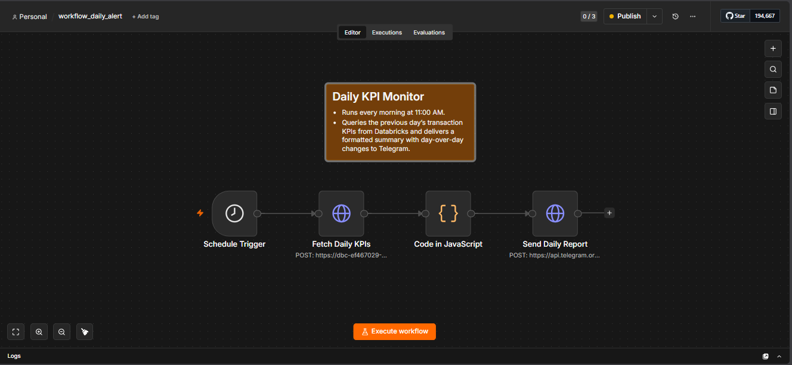
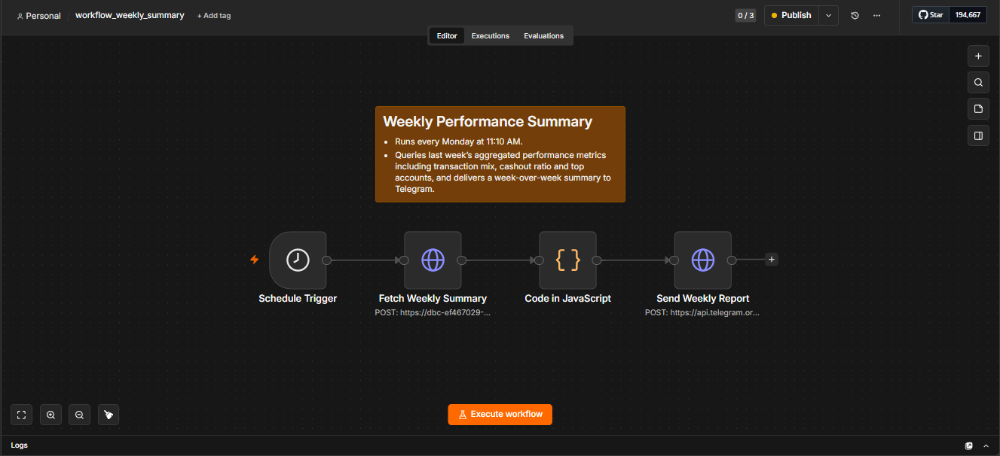
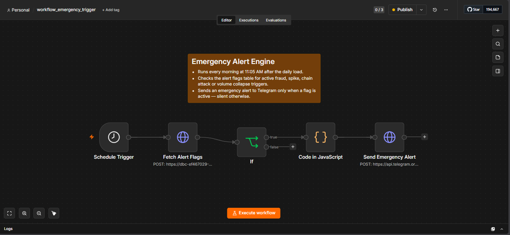

# Automated Transaction Monitoring Pipeline

---

## Project Overview

A cloud-based pipeline that processes 6.3 million mobile money transactions in Databricks, computes daily and weekly business KPIs, evaluates four risk/anomaly triggers using explainable business rules, and delivers automated reports and alerts to Telegram on a cron schedule.

Built to demonstrate cloud-scale data processing, pipeline architecture, and automated business monitoring without requiring anyone to open a dashboard.

**Stack:** Databricks (PySpark / SQL) · n8n · PaySim Dataset · Telegram Bot API

---

## Dataset

[PaySim](https://www.kaggle.com/datasets/ealaxi/paysim1) — a synthetic mobile money transaction dataset generated from real aggregated transaction logs, published as part of academic fraud detection research.

- ~6.3 million transactions · 31 simulated days
- Five transaction types: `CASH_IN`, `CASH_OUT`, `TRANSFER`, `PAYMENT`, `DEBIT`
- Ground-truth fraud labels (`isFraud`) in a realistically imbalanced distribution
- Structural messiness: missing/zeroed balances, inconsistent type behavior, `TRANSFER → CASH_OUT` chains requiring reconstruction

**Date offset simulation.** A date offset is applied at ingestion to shift all transaction dates forward, mapping the dataset's 31 simulated days to a fixed window of real calendar dates. This allows cron-based triggers to query by actual date, treating each day's data as yesterday's live feed and preserving all underlying behavioral patterns. 

---

## Architecture

```
PaySim CSV (6.3M rows)
        |
        | INGESTION
        v
Databricks — Raw Layer
  raw_transactions  →  date offset applied  →  transactions_with_dates
        |
        | TRANSFORMATION
        v
Databricks — Modeled Layer (star schema)
  dim_date · dim_transaction_type · dim_account
  fact_daily_transactions · account_balance_snapshot
        |
        | BUSINESS LOGIC
        v
Databricks — KPI & Risk Layer
  kpi_daily · kpi_weekly
  trigger_transaction_spike · trigger_transfer_cashout_chain
  trigger_fraud_rate_breach · trigger_volume_collapse  →  alert_flags
        |
        | ORCHESTRATION
        v
n8n (cron-triggered workflows)
  ├─ Daily KPI Monitor          → Telegram, every morning
  ├─ Weekly Performance Summary → Telegram, every Monday
  └─ Emergency Alert Engine     → Telegram, only when a flag is active
```

---

## Data Model

Star schema with `fact_daily_transactions` at the center. Daily account states are captured in `account_balance_snapshot`, which tracks closing balances and a rolling 30 day average transaction count per account which is the baseline used for spike detection.

| Table | Purpose |
|---|---|
| `raw_transactions` | Untouched ingested data |
| `transactions_with_dates` | Raw data with simulated dates applied |
| `dim_date` | Date spine — day, week, month, day of week |
| `dim_transaction_type` | Lookup for the five transaction types |
| `dim_account` | Account-level metadata derived from transaction history |
| `fact_daily_transactions` | Core fact table, one row per transaction |
| `account_balance_snapshot` | Daily closing balance and rolling 30-day activity baseline per account |
| `kpi_daily` | Day-over-day business KPIs |
| `kpi_weekly` | Week-over-week rollups and type mix |
| `alert_flags` | Daily boolean state of all four risk triggers |

Full column-level schema: [`docs/project_blueprint.md`](docs/project_blueprint.md)

---

## KPIs

### Daily

| KPI | Definition | Business Reason |
|---|---|---|
| Total Transaction Volume | `SUM(amount)` for the day | Top line health indicator |
| Transaction Count | `COUNT(*)` for the day | A volume drop without a count drop signals that the same number of transactions occurred but each was smaller in value|
| Fraud Flag Rate | `isFraud` count ÷ total transactions | Core fintech health metric; should sit near-zero on a normal day |
| Average Transaction Size | Volume ÷ count | Surfaces behavioral shifts hidden inside top-line totals |

Each KPI is reported alongside its day-over-day percentage change.

### Weekly

| KPI | Definition | Business Reason |
|---|---|---|
| Total Volume (WoW) | `SUM(amount)` for the week vs prior week | Tracks week-level growth or decline beyond daily noise |
| Transaction Count (WoW) | `COUNT(*)` for the week vs prior week | Confirms whether volume shifts are driven by frequency or transaction size |
| Transaction Type Mix | % share of `CASH_IN`, `CASH_OUT`, `TRANSFER` per week | A shifting mix across weeks is a behavioral signal worth investigating |
| Top 5 Accounts by Count | Top 5 accounts ranked by transaction frequency | High frequency is a more meaningful early signal than high value in mobile money |
| CASH_OUT to CASH_IN Ratio | Weekly `CASH_OUT` volume / `CASH_IN` volume | A sustained withdrawal excess over deposits indicates potential liquidity stress |

Each KPI is reported alongside its week-over-week percentage change.

---

## Alert Triggers

Four explainable, rule-based triggers evaluated daily and written to `alert_flags`. Results below reflect actual validated outputs against the PaySim dataset.

| Trigger | Condition | Result |
|---|---|---|
| **Transaction Spike** | An account executes more than 3× its own 30-day average transaction count within 24 hours | 0 rows — PaySim's maximum daily transaction count per account is 2, making the 3× threshold mathematically unreachable. Documented as a validated dataset finding, not removed. |
| **Transfer → Cash-Out Chain** | A `TRANSFER` followed by a `CASH_OUT` from the same destination account on the same calendar day, where the amount exceeds the top 5% of daily transaction amounts | 29 same-day chains identified; 1 exceeds the ~$518K threshold. Primary money-laundering pattern in PaySim, implemented as an explicit auditable rule rather than a model. |
| **Fraud Rate Breach** | Daily `isFraud` rate exceeds 1% of total transactions | Fires on 11 of 31 days. Day 31 shows 100% fraud rate across 274 transactions, kept intentionally as a realistic stress-test of the trigger. |
| **Volume Collapse** | Daily transaction volume drops more than 40% vs. the same day the previous week | Fires on ~10 of 31 days, reflecting genuine volume tapering in the second half of the dataset. |

Full threshold reasoning: [`docs/alert_flag_logic.md`](docs/alert_flag_logic.md)

---

## Automated Workflows (n8n)

Three cron-triggered n8n workflows query the Databricks SQL endpoint directly and deliver formatted messages to Telegram.

### Daily KPI Monitor


Runs every morning at 11:00 AM. Queries `kpi_daily` for the previous day, formats the four KPIs with day-over-day change indicators via a JavaScript Code node, and sends the summary to Telegram.



---

### Weekly Performance Summary


Runs every Monday at 11:10 AM. Queries `kpi_weekly` for the prior week and delivers a formatted week-over-week summary including the transaction type mix and cash-out-to-cash-in ratio.



---

### Emergency Alert Engine


Runs daily at 11:05 AM. Queries `alert_flags` and branches conditionally: if no flag is active, the workflow exits silently without any message being sent. If any flag is active, a formatted alert identifying the specific trigger is delivered to Telegram.



---

## Key Design Decisions

- The spike trigger compares each account against its own 30-day average rather than a fixed company-wide cutoff. A power user making 50 transactions a day is normal behavior; the same volume from an account that averages 2 is an anomaly. This mirrors how real fraud operations teams reason about behavioral deviation.

- The transfer to cash-out chain is implemented as an explicit SQL condition rather than a trained classifier. This keeps the trigger fully auditable if it fires. The exact accounts, amounts, and timing are traceable without interpreting model weights.

- Daily volume is compared against the same day the previous week rather than the previous day, to avoid false alerts from routine weekday patterns.

- Some findings that look like errors are intentional. Trigger 1 returns zero rows due to a structural constraint in how PaySim generates transaction frequency. Day 31 contains a 100% fraud rate confirmed as a simulation artifact. Both are kept and documented rather than filtered out, because hiding them would misrepresent what the data actually shows.

- `MAX_BY` was used over `LAST()` for closing balances to avoid non-deterministic results in Spark without requiring an explicit sort.

---

## Known Limitations

- The pipeline runs on a batch schedule, not a streaming architecture. A production equivalent would use Kafka for ingestion and Databricks Structured Streaming for continuous processing. The architecture here is designed to be compatible with that upgrade path.

- n8n runs locally, so scheduled cron triggers only fire while the instance is running. A VPS or n8n Cloud deployment would enable fully unattended 24/7 operation.

- PaySim is synthetic, not live transaction data. Some patterns like the day-31 fraud spike and volume tapering in the second half  are dataset artifacts rather than real-world events, and are labelled as such throughout.

---

## Repository Structure

```
Automated-Transaction-Monitoring-Pipeline/
│
├── databricks/
│   ├── 01_ingestion/
│   │   ├── load_raw_transactions.py
│   │   └── apply_date_offset.py
│   ├── 02_transformation/
│   │   ├── build_dim_tables.sql
│   │   ├── build_fact_daily_transactions.sql
│   │   └── build_account_balance_snapshot.sql
│   └── 03_kpis/
│       ├── compute_kpi_daily.sql
│       ├── compute_kpi_weekly.sql
│       └── evaluate_alert_flags.sql
│
├── n8n/
│   ├── workflow_daily_alert.json
│   ├── workflow_weekly_summary.json
│   └── workflow_emergency_trigger.json
│
├── docs/
│   ├── project_blueprint.md
│   ├── alert_flag_logic.md
│   ├── screenshots/
│   │   ├── workflow_daily_alert_canvas.png
│   │   ├── workflow_weekly_summary_canvas.png
│   │   └── workflow_emergency_trigger_canvas.png
│   └── gifs/
│       ├── workflow_daily_alert_demo.gif
│       ├── workflow_weekly_summary_demo.gif
│       └── workflow_emergency_trigger_demo.gif
│
└── README.md
```

---

## Running This Project

Credentials are not included in this repository. To run it yourself:

1. Upload the [PaySim dataset](https://www.kaggle.com/datasets/ealaxi/paysim1) to a Databricks workspace and run scripts under `databricks/` in order (01 → 02 → 03).
2. Install n8n (local Docker or n8n Cloud) and import the three JSON files from `n8n/`.
3. Create a Telegram bot via [@BotFather](https://t.me/BotFather) and a Databricks SQL warehouse. Configure both as credentials inside n8n — not inline in the workflow files.
4. Activate the workflows.

---

*Built by Pallab Dey*
- **Email**: pallabdey21@gmail.com  
- **LinkedIn**: [linkedin.com/in/pallabdey007](https://www.linkedin.com/in/pallabdey007)  
- **GitHub**: [github.com/Rusher0077](https://github.com/Rusher0077)  
